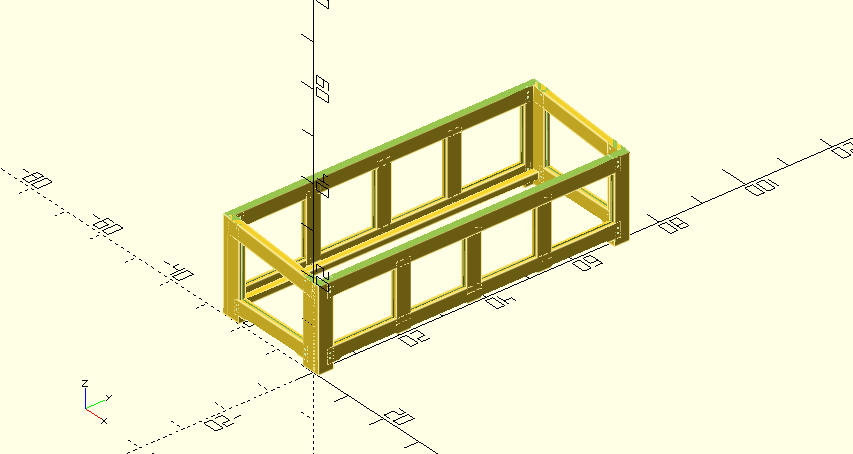
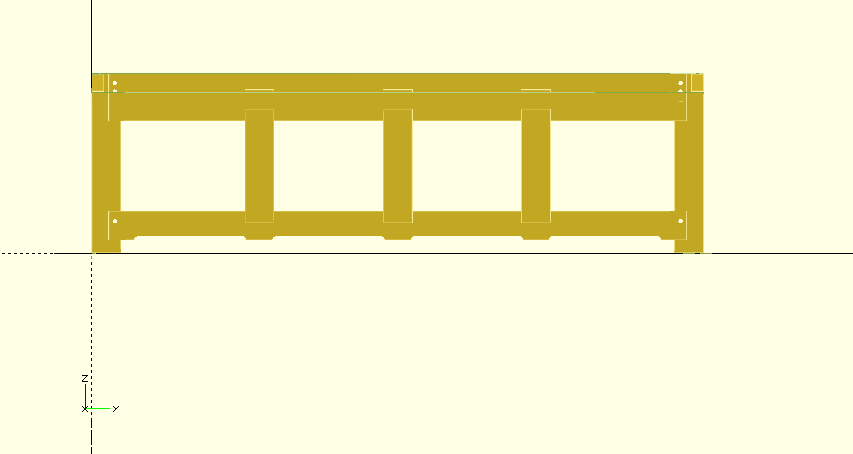
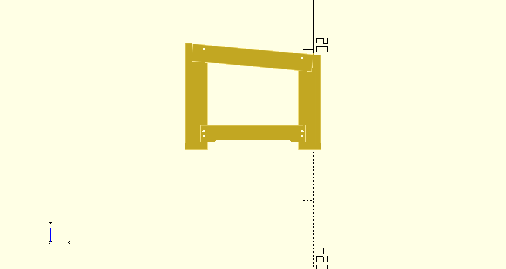
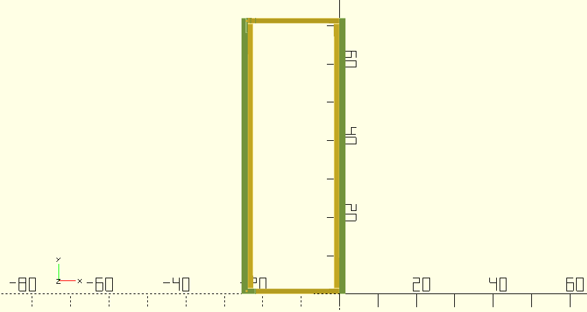
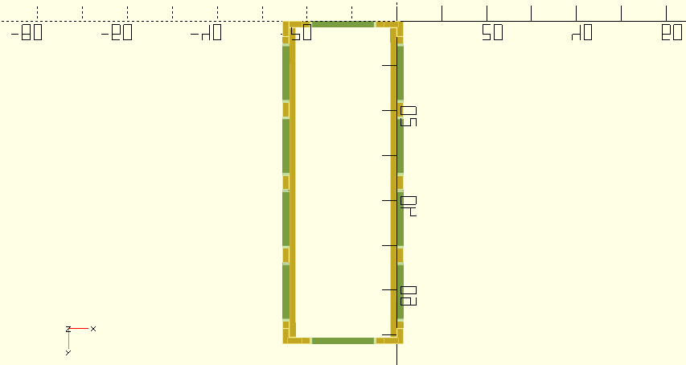

# Deck Box
Free up garage space by storing stuff outside. 

## Requirements
1. Needs to withstand gale force winds.
1. Needs to not pool rainwater.
1. Needs to be water resistant on the inside.
1. Needs to be lockable.
1. Underneath needs to be serviceable.
1. Needs to be 6' long inside for the obedience jumps.  
1. Can be 2' in depth inside if the jumps are disassembled at the bottom.  
1. Can be 3' in depth inside w/o disassembling the jumps.  
1. 3' x 6' Can be placed outside the office next to the heat pump.
1. 2' x 6' can be placed behind the fireplace underneath the overhang.
1. Needs to double as a bench and allow sitting.

## Plan
Create 2 boxes out of cedar. a 2'x6' and a 3'x6'. Do the 2'x6' first. sloped lid.

### 2' x 6' Measurements
ECHO: 85 - top angle

Front:

ECHO: "face leg left 2x4 height:", 19  
ECHO: "top rail notch Z", 16  
ECHO: "top rail notch height", 2.5  
ECHO: "bottom rail notch Z", 2  
ECHO: "bottom rail notch height", 2.5  
ECHO: "face leg left 2x4 height:", 19   
ECHO: "top rail notch Z", 16  
ECHO: "top rail notch height", 2.5 
ECHO: "bottom rail notch Z", 2  
ECHO: "bottom rail notch height", 2.5  
ECHO: "section length:", 16.25  

Back:

ECHO: "face leg left 2x4 height:", 21.25  
ECHO: "top rail notch Z", 18.25  
ECHO: "top rail notch height", 2.5  
ECHO: "bottom rail notch Z", 2  
ECHO: "bottom rail notch height", 2.5  
ECHO: "face leg left 2x4 height:", 21.25  
ECHO: "top rail notch Z", 18.25  
ECHO: "top rail notch height", 2.5  
ECHO: "bottom rail notch Z", 2  
ECHO: "bottom rail notch height", 2.5  
ECHO: "section length:", 16.25  

## Lumber calc

### 2'x6' box
S4S Cedar 2x4 x 8' =  
faces : 7 +  
sides : 2 +   
top : 3 = **12**

Cedar 1x6-8' · Select Tight Knot · S1S2E · Green =  
faces: 8  
sides: 3  
total: **11**  

Cedar Decking · 5/4x6-8' · Select Tight Knot · KD Radius Edge =  
floor: 4
top: 4  
total: **8**
